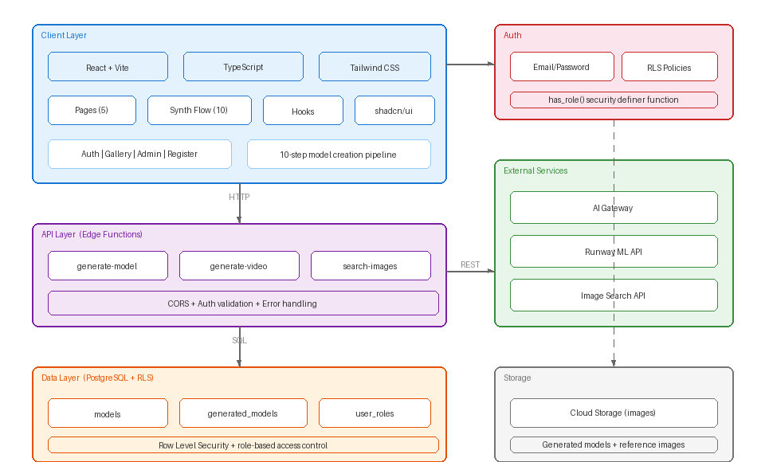

# AI Model Synthesis Platform

Interactive prototype and conceptual architecture of an AI-powered platform designed to create synthetic models from real-world datasets, with a strong focus on transparency, attribution, and value distribution.

---

## Context

The rise of generative AI in creative industries introduces new opportunities, but also raises important questions around ownership, attribution, and fair compensation.

In industries such as fashion and modeling, the ability to generate synthetic models from existing datasets creates both efficiency gains and ethical challenges.

This project explores how a platform could enable the creation of AI-generated models while ensuring transparency and proportional value distribution to original contributors.

---

## Objective

Design an interactive system capable of:

* Simulating the creation of AI-generated models from reference datasets
* Providing a visual and intuitive user journey for creative professionals
* Ensuring transparency in how models are generated and composed
* Demonstrating attribution and proportional compensation logic
* Communicating complex AI workflows through a simple and engaging interface

---

## Experience Flow

The platform is structured as a guided, step-by-step simulation of the model creation journey:

1. **Model Description Input**
   Users define desired attributes for a synthetic model

2. **Reference Selection**
   Selection of real models used as input for synthesis

3. **Pose and Style Definition**
   Configuration of visual characteristics

4. **AI Generation**
   Simulated generation of the final synthetic model

5. **Transparency & Attribution**
   Visualization of contribution percentages and value distribution

6. **Dashboard View (Optional)**
   Overview of platform metrics and contributor activity

---

## Architecture Overview

The system is designed as a frontend-driven simulation platform, focusing on experience, interaction, and conceptual modeling.

### Core Components

* **User Interface Layer**
  Interactive frontend built to simulate real product usage

* **Experience Orchestration Layer**
  Manages state transitions, step progression, and interaction flows

* **Simulation Engine**
  Handles mock data generation, scoring, and attribution logic

* **Visualization Layer**
  Responsible for charts, animations, and transparency metrics

* **Asset Layer**
  Manages images, references, and visual assets

---

## Design Principles

* **Transparency by design**: clear visibility into how outputs are generated
* **User-centric storytelling**: complex processes simplified through interaction
* **Modularity**: separation between simulation, UI, and visualization
* **Scalability of concept**: foundation for future real backend integration
* **Ethical AI considerations**: attribution and fair value distribution

---

## Technical Perspective

This prototype focuses on experience simulation rather than backend complexity, leveraging:

* React for component-based UI
* Tailwind CSS for structured and scalable styling
* Framer Motion for smooth transitions and animations
* Recharts for data visualization
* Local state for simulating AI processes and system responses

The architecture allows future evolution into a fully integrated platform with real AI models and backend services.

---

## Trade-offs

* Real AI processing vs. simulated experience
* Visual fidelity vs. implementation complexity
* Frontend-driven logic vs. backend orchestration
* Concept validation vs. production readiness

---

## Possible Evolution

* Integration with real generative AI models
* Backend services for model training and inference
* Blockchain or ledger-based attribution tracking
* Marketplace for synthetic model licensing
* Advanced analytics for contributors and usage

---

## Purpose of this Repository

This repository demonstrates:

* Product thinking applied to AI-driven platforms
* Design of interactive and explainable AI experiences
* Ability to communicate complex systems through UX and architecture
* Exploration of ethical and economic implications of generative AI

It is intended as a conceptual and strategic prototype rather than a production-ready system.

---
